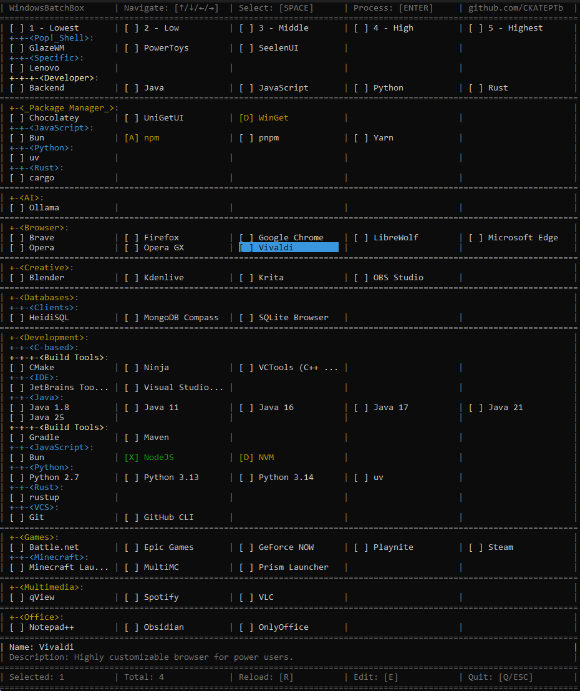

# WindowsBatchBox

WindowsBatchBox is a TUI orchestrator for `.bat` scripts based on YAML manifests.  
It recursively scans the project root, builds a category tree from folders, and lets you run software setup/configuration in batches (including presets and bundles).



## What It Does

- Runs via `WindowsBatchBox.bat`.
- Automatically requires administrator privileges (UAC elevation).
- Installs Chocolatey if `choco` is not found (required for `refreshenv`).
- Extracts the embedded PowerShell part from the same `.bat` file and starts the TUI.
- Loads YAML scripts (`*.yaml`, `*.yml`) recursively from the repository root.
- Executes selected scripts with dependency resolution through `depends`.

## Quick Start

1. Run `WindowsBatchBox.bat`.
2. Confirm administrator elevation.
3. Select items in the TUI (`Space`).
4. Press `Enter` to execute the selected set.

## TUI Controls

- `Arrow keys` - navigation.
- `Space` - toggle selection.
- `Enter` - run selected scripts.
- `E` - open the current YAML file in the default editor.
- `R` - reload YAML files and rebuild the menu without restarting.
- `Q` or `Esc` - quit.

## Status Legend

- `[ ]` - not selected.
- `[X]` - selected by user.
- `[D]` - dependency (will run automatically before the target script).
- `[A]` - include marker (shown as related; see the note below).

## Project Structure

Any folder is treated as a category. Category nesting depth is unlimited.

Example:

```text
Development/
  JavaScript/
    NodeJS.yaml
    NVM.yaml
```

`NodeJS.yaml` appears under `Development > JavaScript`.

## YAML Format

Required fields:

- `name` (string) - script name (used as an ID in dependencies).
- `script` (multiline string) - bat commands to execute.

Optional fields:

- `description` (string) - shown in the bottom TUI panel.
- `depends` (string[]) - scripts that must run earlier.
- `includes` (string[]) - related scripts (visual/logic relation).

Example:

```yaml
name: NodeJS
description: JavaScript runtime built on Chrome's V8 engine
script: |
    where node >nul 2>nul || (nvm install lts && nvm use lts)
depends:
  - NVM
includes:
  - npm
```

## Execution Model

- A temporary `.bat` is generated in `%TEMP%` for each run.
- `refreshenv` (if available) is prepended, then the YAML `script` body.
- In practice, `refreshenv` comes from Chocolatey, so the runner checks/installs `choco` first.
- Before execution, `SCRIPT_SOURCE` is set to the current script YAML path.
- Scripts run in topological order based on `depends`.
- If a dependency fails, dependent scripts are skipped.
- `exit code 0` is treated as success (also `-1978335189`).

## Important `includes` Note

In the current implementation, `includes` is used for `[A]` markers and transitive relation highlighting in UI,  
but it **does not add scripts to automatic execution order** (unlike `depends`).

If you need guaranteed pre-execution, use `depends`.

## YAML Authoring Recommendations

- Keep `name` unique across the entire project.
- In `depends/includes`, use exact names from `name`.
- For bundles/presets, you can use a minimal `script` (for example `@echo off`) and compose behavior through `depends`.
- Keep commands idempotent (`where ... || install ...`) so reruns are safe.

## Typical Use Cases

- Fast workstation bootstrap on a fresh Windows machine.
- Building personal software/tweak bundles.
- Automating post-install configuration via bat commands.
