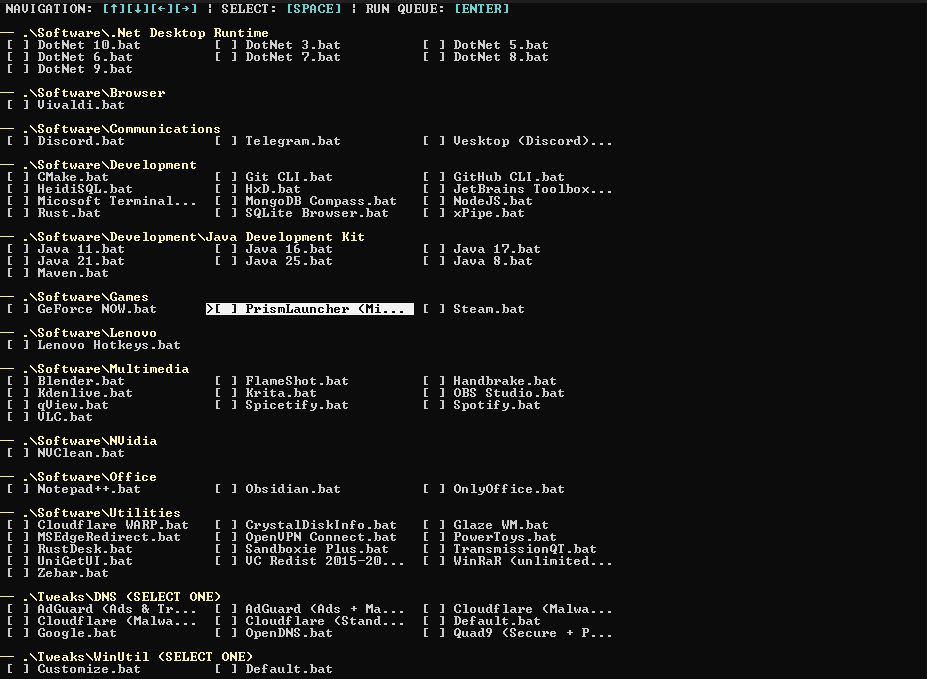

# Todo - ADD CONFIGURED BUNDLES; ADD TWEAKS; UPDATE README

# 🛠️ Win-11-Tuner

A modular, keyboard-driven **TUI (Text User Interface)** orchestrator for automated Windows 11 setup. This tool streamlines the deployment of software and system optimizations using a simple, folder-based logic.

## 🚀 Concept & Architecture

The project is designed to be a **pluggable framework**. You don't need to hardcode the menu; the interface follows a simple directory-to-UI mapping:

* 📂 **Folder = Category:** Every subfolder (e.g., `.Software\Development`) automatically becomes a section in the TUI.
* 📄 **.bat File = Feature:** Each batch script represents a single action. It can be a software installer, a registry tweak, or a complex configuration script.
* ⚙️ **Custom Configs:** Apps are bundled with pre-set preferences, making it an "install and forget" solution.

## 🛠️ Use as a Template

Win-11-Tuner is a perfect foundation for creating your own **custom Windows builds**:
1.  **Modular:** Just drop a new `.bat` file into any category folder, and it will appear in the menu.
2.  **Extensible:** Create new categories by simply adding folders.
3.  **Flexible:** Since it's all Batch, you can trigger anything from `winget` commands to manual file copying and environment variable setups.

## ⌨️ Controls

| Key | Action |
| :--- | :--- |
| **[↑][↓][←][→]** | Navigate through categories and features |
| **[SPACE]** | Select / Deselect item |
| **[ENTER]** | Run the selected installation queue |

---
*Note: This setup contains my personal configurations. Feel free to fork it and modify the scripts to match your own requirements!*
